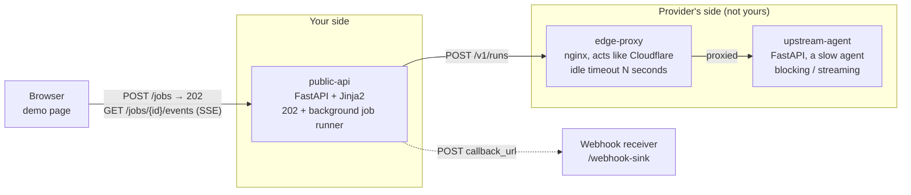

# SSE Upstream Timeout Demo

A small, runnable demo of how to get a result back from a slow HTTP-only upstream when
there's a gateway with an idle timeout in the way. It shows what streaming over
Server-Sent Events (SSE) fixes, and also what it doesn't: the stream only survives if the
**upstream** keeps sending bytes, and that's usually not something the caller controls.

## Why this demo exists

1. **Many upstream services only speak HTTP.** LLM providers, Dify workflows, and most
   hosted AI agents are called over plain HTTP. They aren't yours, so you can't move the
   work into your own background worker and message queue (for example, Celery +
   RabbitMQ) and pick up the result from there. You get whatever interface they offer:
   usually a blocking call or a streaming call.
2. **They often sit behind a gateway with a hard timeout.** Cloudflare, for example,
   closes the connection with a `524` if the origin sends nothing for 100 seconds. An
   agent that thinks for two minutes and then returns one JSON body never makes it through:
   the blocking call is cut off and the answer is lost. Dify's API docs warn about this for
   `blocking` mode on Dify Cloud, which sits behind Cloudflare.
3. **Streaming can keep the connection alive, as long as data keeps flowing.** The limit
   applies to *time without data*, not to how long the response takes in total. With the
   response streamed over SSE, the connection survives any run length, **provided the
   upstream sends something during its longest silence**: a keep-alive ping or a progress
   event. This repo shows when that's true, when it isn't, and what the caller can do
   about it.

All four situations run side by side with a real reverse proxy in the middle, so you can
see connections drop rather than just read about it.

## What you'll see

Open the page, click **Run all four**, and watch the scenarios run at the same time. With
the defaults, the agent takes 30 seconds, 24 of them in one long step, and the gateway gives
up after 15 seconds without data.

| Scenario | Who decides | What goes over the wire | Result |
|---|---|---|---|
| **Blocking call** | Caller (`response_mode=blocking`) | Nothing, until the run is finished | **Fails.** At 15 s the gateway answers `524`. The upstream keeps working, but nobody is left to receive the answer. |
| **Streaming, upstream sends keep-alives** | Provider | Events, plus `: ping` every 5 s during the long step | **Succeeds.** Never idle for more than 5 s. The final answer arrives at about 30 s. |
| **Streaming, upstream sends no keep-alives** | Provider | Events, then nothing for 24 s | **Fails.** The gateway closes the stream 15 s into the long step. The caller can't prevent this: nothing it sends resets the timer. |
| **No keep-alives, progress events turned on** | Caller (`stream_progress=true`) | Same upstream without pings, but a progress event every 4 s | **Succeeds.** The progress events keep data flowing, so the answer arrives. |

Each card has an **idle meter** that shows how long it's been since the upstream last sent
anything, filling up toward the gateway's timeout. When a job finishes, the meter shows the
**longest silence** the upstream left, based on the server's timestamps: 15.0 s for the two
failures, and no more than the ping or progress interval for the two successes.
Finished jobs also POST their result to a webhook, which shows up in the **Webhook inbox**
at the bottom of the page.

## Who has to send the keep-alive?

**The upstream.** An idle timeout like Cloudflare's counts the time since the *origin* last
sent data. Only bytes coming from the upstream reset it. The caller can send whatever it
likes; that never resets the timer.

So streaming is *necessary but not sufficient*. What matters is which hop has the
timeout:

| Where the idle timeout is | Who can fix it |
|---|---|
| **The provider's own gateway** (for example, Cloudflare in front of Dify Cloud) | Only the provider. A provider that offers streaming behind its own gateway has a strong reason to keep that stream alive, because otherwise its own streaming mode breaks for everyone. In practice many do send pings, but check. |
| **Your side** (egress proxy, NAT gateway, load balancer) | You: raise or remove the timeout, route around that hop, or turn on TCP keep-alive (this only helps with layer-4 devices such as NAT, not HTTP proxies). |
| **Your service to your users** (public API → browser or webhook) | You: send your own heartbeats. The public API here does, through FastAPI's `EventSourceResponse`. |

A relay you add in the middle can only add heartbeats for the hops *after* it. It can't
stop the provider's gateway from closing the connection *before* it.

### Before you rely on streaming, check the upstream

- **Does it send anything during its longest silence?** That means pings, or events that
  arrive often enough, such as tokens, reasoning summaries, or workflow node events. The
  risky parts are waiting for the first token, long reasoning phases, and slow tool
  calls.
- **What do the docs promise?** For example, Dify Cloud sends a `ping` event about every
  10 seconds in streaming mode. That figure is for the **Cloud version**; a self-hosted Dify
  (or one behind your own proxy) may behave differently, so don't assume 10 seconds there.
  Anthropic's docs say a stream may include `ping` events without promising how often. Other providers may send nothing while a model is
  thinking. Docs change, so check the current version and **measure the longest gap
  yourself** with a real, long request.
- **Do headers arrive right away?** Some services hold the response headers until the
  first token. A long queue before that point counts as silence too.

### If the upstream won't keep the stream alive

1. **Use its asynchronous API** (submit, then poll or get a webhook) if it has one. This is
   the most robust option because it doesn't rely on a long connection.
2. **Turn on options that produce output along the way**: streamed reasoning summaries,
   workflow node events, token streaming instead of one final answer. This is what the
   fourth scenario does.
3. **Split the work** into calls that each finish well within the timeout.
4. **Make failures recoverable**: resume the stream or fetch the result by ID if the API
   allows it, and retry idempotently.
5. **If you host the upstream yourself** (for example, self-hosted Dify), call the origin
   directly, bypassing the gateway, or raise the gateway's timeout.

## Quick start

Requirements: Docker with Compose v2.

```bash
docker compose up --build
```

Then open <http://localhost:8000>.

To see the real Cloudflare numbers instead of the shortened demo ones:

```bash
cp .env.example .env
# edit .env: EDGE_READ_TIMEOUT=100, AGENT_DURATION=130
docker compose up --build
```

Stop everything with `docker compose down`.

## Architecture



The diagram source is [`docs/architecture.mmd`](docs/architecture.mmd).

| Service | Role | Exposed on the host |
|---|---|---|
| `public-api` | The service you own. Accepts jobs with `202 Accepted`, calls the upstream in the background, reports progress to the browser over SSE and delivers the final result to a webhook. Serves the demo page. | `127.0.0.1:8000` |
| `edge-proxy` | Stands in for the provider's gateway. nginx with `proxy_read_timeout` set to `EDGE_READ_TIMEOUT`; when nothing has arrived before the timeout, it answers `524` like Cloudflare does. | `127.0.0.1:8080` (for curl) |
| `upstream-agent` | Stands in for Dify or an LLM provider. `POST /v1/runs` with `response_mode: blocking \| streaming` (the same switch Dify uses) and an optional `stream_progress`. | not exposed |

### Request flow (streaming, upstream sends keep-alives)

See [`docs/request-flow.mmd`](docs/request-flow.mmd) for the sequence diagram.

## How it works

### Idle timeouts vs. total timeouts

nginx's `proxy_read_timeout` is the longest it waits **between two reads** from the
upstream, not a limit on the whole response. Cloudflare's 100-second limit (the `524`
error) works the same way. So any bytes from the upstream restart the timer, including an
SSE comment line that clients ignore. See `edge-proxy/default.conf.template`.

### The upstream's keep-alive (the provider's part)

`upstream-agent/app/sse.py` shows what a well-behaved upstream does. `with_heartbeat()`
waits for the agent's next event, and if none arrives within `HEARTBEAT_INTERVAL` seconds,
it sends a `: ping` comment and keeps waiting. The pending `__anext__()` runs as a task that
survives these timeouts, so a heartbeat never cancels or restarts the agent's work.

In the demo, the request field `demo_keepalive` switches this on or off so one container
can act as two different kinds of provider. Real APIs have no such field: whether pings are
sent is decided by whoever built the stream.

If you build a streaming service yourself, pick an interval well below the smallest idle
timeout anywhere on the path, including proxies, load balancers, and NAT gateways, not only
Cloudflare. 10 to 30 seconds is common.

> **Note on FastAPI's built-in SSE.** Recent FastAPI versions (`fastapi.sse.EventSourceResponse`)
> already send a `: ping` every 15 seconds. That's convenient in real services, but the
> interval can't be changed or switched off, which this demo needs for the no-keep-alive
> scenarios. So the upstream builds its stream itself with FastAPI's `format_sse_event()`
> helper. The public API's browser-facing stream uses `EventSourceResponse` as is.

### Progress events (the caller's part)

`stream_progress: true` is a real caller option, like turning on streamed reasoning
summaries. During long steps the agent then sends a `step_progress` event every
`PROGRESS_INTERVAL` seconds. These are ordinary data events, and they reset the gateway's
timer just as pings do.

### Keeping proxies from buffering

A streamed response only helps if the bytes actually flow through each hop. The upstream
sends:

- `Content-Type: text/event-stream`
- `Cache-Control: no-cache`
- `X-Accel-Buffering: no`: tells nginx (and nginx-based gateways) not to buffer this response

The edge proxy keeps nginx's default buffering on, like a real gateway would, and relies
on that header. Also avoid compressing the stream, because compressors hold bytes back
until they have a full block.

### The public API side

1. `POST /jobs` stores the job, starts a background task, and returns `202` immediately,
   so the user's request never waits on the upstream.
2. `JobRunner` (`public-api/app/runner.py`) picks the `UpstreamClient` for the job's mode:
   - `BlockingUpstreamClient`: one `POST`, then wait for the JSON body.
   - `StreamingUpstreamClient`: `httpx` streaming plus a small SSE parser that also
     reports comment lines, so pings show up on the page.
3. Our own `httpx` read timeout is deliberately long (600 s). Every failure you see comes
   from the gateway, not from our client giving up.
4. The result reaches the user in two ways:
   - **Browser:** `GET /jobs/{id}/events` is an SSE stream of the job's timeline. It
     honours `Last-Event-ID`, so a reconnecting `EventSource` resumes without duplicates.
   - **Webhook:** if the job has a `callback_url`, the result is POSTed there.
     `POST /webhook-sink` is a built-in receiver so the demo works on its own.

## Try it with curl

The edge proxy is published on `127.0.0.1:8080`, so you can talk to the upstream through
it directly.

```bash
# Blocking: about 15 s of silence, then the gateway's 524.
curl -i localhost:8080/v1/runs -H 'content-type: application/json' \
  -d '{"query": "hi", "duration_seconds": 30, "response_mode": "blocking"}'

# Streaming from an upstream that sends keep-alives: pings, then run_finished.
curl -N localhost:8080/v1/runs -H 'content-type: application/json' \
  -d '{"query": "hi", "duration_seconds": 30, "response_mode": "streaming"}'

# Streaming from an upstream that sends no keep-alives: the stream stops partway
# through (curl reports an incomplete chunked transfer).
curl -N localhost:8080/v1/runs -H 'content-type: application/json' \
  -d '{"query": "hi", "duration_seconds": 30, "response_mode": "streaming", "demo_keepalive": false}'

# Same upstream, with progress events turned on by the caller: it completes.
curl -N localhost:8080/v1/runs -H 'content-type: application/json' \
  -d '{"query": "hi", "duration_seconds": 30, "response_mode": "streaming", "demo_keepalive": false, "stream_progress": true}'
```

And the public API itself (`mode` is one of `blocking`, `streaming_keepalive`,
`streaming_no_keepalive`, `streaming_progress`):

```bash
curl -i localhost:8000/jobs -H 'content-type: application/json' \
  -d '{"mode": "streaming_keepalive", "duration_seconds": 30, "callback_url": "http://public-api:8000/webhook-sink"}'
curl -N localhost:8000/jobs/<job_id>/events
curl -s localhost:8000/webhook-sink
```

Interactive API docs are at <http://localhost:8000/docs>.

## Configuration

Set these in `.env` (see `.env.example`). `compose.yaml` passes them to the containers.

| Variable | Default | Meaning |
|---|---|---|
| `EDGE_READ_TIMEOUT` | `15` | Seconds the gateway waits for the next byte from the upstream. Cloudflare's value is `100`. |
| `AGENT_DURATION` | `30` | Default run time of the simulated agent. 80% of it is one long step. |
| `HEARTBEAT_INTERVAL` | `5` | Seconds between `: ping` comments, for the simulated upstream that sends keep-alives. With a real provider this isn't yours to set. |
| `PROGRESS_INTERVAL` | `4` | Seconds between `step_progress` events when the caller turns on `stream_progress`. |
| `PUBLIC_PORT` | `8000` | Host port for the demo page. |

The long step is 80% of the run, so it's longer than the gateway timeout in both the quick
setup (24 s > 15 s) and the realistic one (104 s > 100 s).

## Project layout

```text
.
├── compose.yaml
├── .env.example
├── docs/                       # Mermaid diagrams (architecture, request flow)
├── edge-proxy/
│   └── default.conf.template   # the provider's gateway: idle timeout, 524
├── upstream-agent/             # the slow HTTP-only upstream (provider's side)
│   ├── Dockerfile
│   ├── pyproject.toml / uv.lock
│   └── app/
│       ├── main.py             # POST /v1/runs: blocking JSON or SSE
│       ├── agent.py            # Agent protocol + SimulatedAgent (weighted steps, progress)
│       ├── sse.py              # SSE encoding, keep-alive, no-buffering response
│       ├── schemas.py
│       └── config.py
└── public-api/                 # the service you own and your users call
    ├── Dockerfile
    ├── pyproject.toml / uv.lock
    └── app/
        ├── main.py             # app wiring (lifespan builds clients and services)
        ├── routes/             # pages, jobs (202 + SSE), webhook sink
        ├── runner.py           # JobRunner: background execution + callback
        ├── upstream.py         # UpstreamClient protocol: blocking / streaming clients
        ├── sse_parser.py       # SSE parser that keeps comment lines
        ├── store.py            # JobReader / JobWriter protocols + in-memory store
        ├── notifier.py         # ResultNotifier protocol + webhook implementation
        ├── inbox.py            # demo webhook inbox
        ├── models.py
        ├── config.py
        ├── templates/index.html
        └── static/             # app.js, style.css
```

Both images use a multi-stage build. uv resolves the dependencies into a virtualenv in the
builder stage. The runtime stage is plain `python:3.13-slim` with only that virtualenv and
the code copied over, so there's no uv in the final image. The app runs as the non-root
user `app` (uid 10001), and the edge proxy uses the unprivileged nginx image.

## Other limits

- **Hard limits on total duration can't be streamed around.** Examples are AWS API Gateway's
  29-second integration timeout, a Cloud Tasks dispatch deadline, a serverless platform's
  maximum request duration, or a client with a total timeout. If any hop caps the
  whole request, it doesn't matter how much you stream.
- **The result only lives as long as the connection.** Here the job is held by one
  process, in memory. If the public API restarts in the middle of a run, the job is lost. For
  durability, put a background worker and message queue in front (for example, Celery +
  RabbitMQ, or Cloud Tasks) and **still stream from the worker to the upstream**. The queue decides who does the work and handles retries;
  streaming keeps the connection to the upstream alive. They work at different layers, so
  you often want both.
- **A blocking call that times out still costs money.** The upstream keeps working after
  the gateway gives up. `docker compose logs upstream-agent` shows the blocking run
  finishing long after the `524`.
- **Validate callback URLs in real services.** This demo POSTs to any `callback_url` it's
  given. A real service must restrict or check these URLs to avoid server-side request
  forgery (SSRF).

## Development

Each service is its own uv project, checked with Ruff (lint and format) and mypy in
strict mode:

```bash
cd public-api            # or upstream-agent
uv sync
uv run ruff check . && uv run ruff format --check .
uv run mypy app
```
